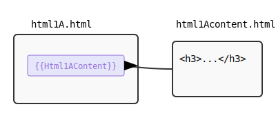
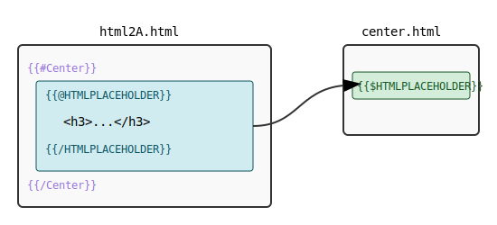
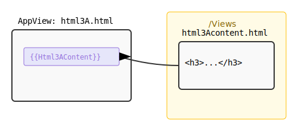
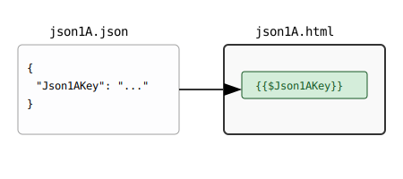
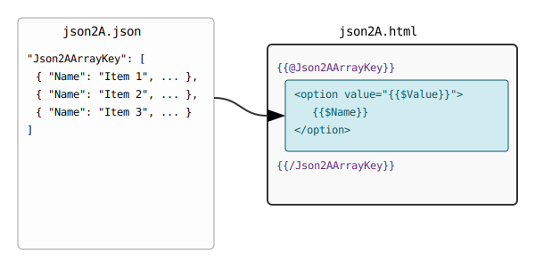

# Assembler Composition Rules

This document outlines the five core composition rules used in the Arshu Assembler framework. These rules define how HTML templates and JSON data are merged to generate the final output.

## HTML Composition Rules

### 1. Direct Composition

**Concept:** A main template directly includes the content of another HTML file.

**Mechanism:** The main template uses a `{{ComponentName}}` placeholder. The engine replaces this placeholder with the content of `ComponentName.html`, which is typically located in a `Component/` subdirectory.

---

### 2. Slotted Composition

**Concept:** A main template defines content that is then placed into a specific "slot" within a reusable layout template.

**Mechanism:**

1. A layout template (e.g., `center.html`) defines a slot using a `{{$SlotName}}` placeholder.
2. The main template invokes the layout using a `{{#LayoutName}}...{{/LayoutName}}` block.
3. Inside this block, the main template specifies the content for a slot using an `{{@SlotName}}...{{/SlotName}}` block.

This allows for creating reusable page layouts where only specific sections change.

---

### 3. Contextual Composition

**Concept:** A template includes content from a component whose location is determined by the current application context or view.

**Mechanism:** The main template (e.g., `html3A.html`) uses a `{{ComponentName}}` placeholder. The engine resolves this by looking for `ComponentName.html` within a context-specific `Views/` directory. This allows different views to use the same placeholder name but load different content.

## JSON Composition Rules

### 4. JSON Key Composition

**Concept:** A template is populated with simple string values from a corresponding JSON file.

**Mechanism:**

1. A template (e.g., `json1A.html`) is paired with a data file of the same name (`json1A.json`).
2. The JSON file contains simple key-value pairs.
3. The template uses `{{$JsonKey}}` placeholders to access and display the values from the JSON file.

---

### 5. JSON Array Composition

**Concept:** A template iterates over an array of objects from a JSON file to generate a block of HTML for each item.

**Mechanism:**

1. A JSON file contains a key that holds an array of objects.
2. The template uses a `{{@ArrayKey}}...{{/ArrayKey}}` block to loop through the array.
3. Inside the loop, `{{$ObjectKey}}` placeholders are used to access the properties of each object in the current iteration.
4. The framework also supports conditional blocks (`{{@ConditionKey}}...{{/ConditionKey}}`) to render content if a key is true/truthy, and empty-state blocks (`{{^ArrayKey}}...{{/ArrayKey}}`) for when the array is missing or empty.

